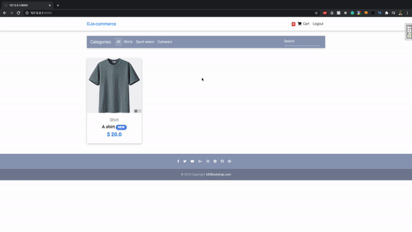

# Django E-commerce

This is a very simple e-commerce website built with Django.

# Final Product

---

## Project Summary

The website displays products. Users can add and remove products to/from their cart while also specifying the quantity of each item. They can then enter their address and choose Stripe to handle the payment processing.

----
# 🔗 Links - Rana Ahtsham

